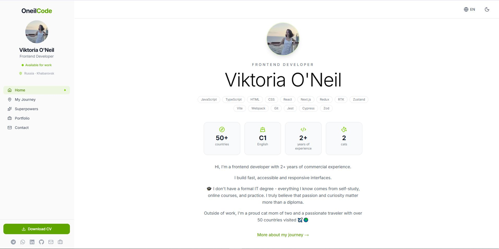
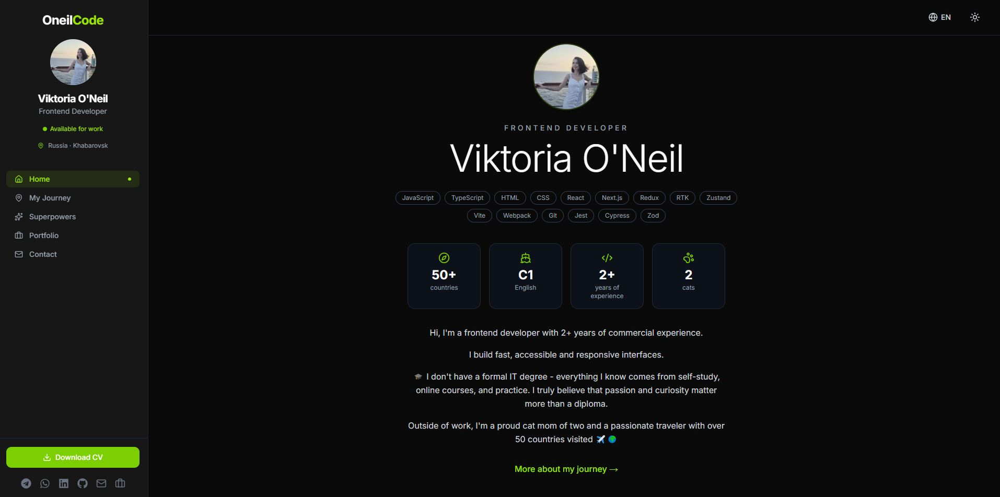

# 🚀 OneilCode | Portfolio Website

---

## 📖 About the Project

This is my personal **portfolio website** - a digital business card that showcases who I am as a Frontend Developer.

The site tells my story, presents my projects, describes my skills, and gives visitors an easy way to get in touch. It's not just a static page - it's a full-featured web application with localization, dark mode, animations, a working contact form, and an admin panel for managing incoming messages.

**Key sections:**

- **Home**: a brief introduction with my role, and core technologies
- **My Journey**: a timeline of my path into IT, including education and work experience
- **Portfolio**: a list of my projects with detailed pages for each
- **Skills & Tech**: an overview of technologies I work with and what I can do with them
- **Contact**: a form to reach out, with messages stored in a database
- **Admin Panel**: a private page where I can view and manage incoming messages
---

## 🌐 Live Demo

👉 **[oneilcode-dev.vercel.app](https://oneilcode-dev.vercel.app)**

| Light theme | Dark theme |
|-------------|------------|
|  |  |
---

## ✨ Features

- **Internationalization (EN/RU)** — full support for two languages
- **Dark / Light theme** — with user preference saved
- **Responsive design** — works on mobile, tablet, and desktop
- **Smooth animations** — page transitions and element appearances
- **Contact form** — validated, stored in Supabase, with Telegram notifications
- **Admin panel** — protected by password, for viewing messages
- **Testing** — unit tests with Vitest and React Testing Library
- **CI/CD** — automated testing and deployment via GitHub Actions + Vercel

---

## 🛠️ Tech Stack

- Next.js
- React
- TypeScript
- Tailwind CSS
- Shadcn/ui
- Framer Motion
- Supabase
- next-intl
- next-themes
- Zod
- React Hook Form
- Vitest
- ESLint
- Prettier
- Husky

---

## 📫 Contact

**Viktoria O'Neil** | Frontend Developer

- 🌐 [Portfolio](https://oneilcode-dev.vercel.app)
- 💼 [LinkedIn](https://www.linkedin.com/in/viktoriia-o-neil-956167228/)
- 📱 [Telegram](https://t.me/vikaoneil)
- 📧 [Email](mailto:oneilcode111@gmail.com)
- 📝 [Habr](https://career.habr.com/vikaoneil)
- 🐙 [GitHub](https://github.com/oneilcode)

